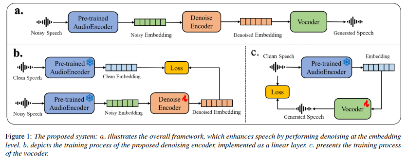

<div align="center">
    <h1>
    Dasheng Denoiser
    </h1>
    <p>
    Official PyTorch inference code for the Interspeech 2025 paper: <br>
    <b><em>Efficient Speech Enhancement via Embeddings from Pre-trained Generative Audioencoders</em></b>
    </p>
    <a href="https://arxiv.org/"></a>
    <a href="https://www.python.org"></a>
    <a href="https://pytorch.org"></a>
    <a href="https://www.apache.org/licenses/LICENSE-2.0"></a>


</div>


# System Framework

This paper introduces an efficient and extensible speech enhancement method. Our approach involves initially extracting audio embeddings from noisy speech using a pre-trained audioencoder, which are then denoised by a compact encoder network. Subsequently, a vocoder synthesizes the clean speech from denoised embeddings. An ablation study substantiates the parameter efficiency of the denoise encoder with a pre-trained audioencoder and vocoder.




# Pre-trained Model and Demos

| model   | # parametars  | demos  |
|--------------------------------------------------------|-------------------------------------------| ----|
| [dasheng-denoiser](https://zenodo.org/records/15541088/files/dasheng-denoiser_checkpoint.pt?download=1)       | 118.5 M  | [demo page](https://xingws.github.io/dasheng-denoiser_demo/) |


# Installation and Usage
```bash
pip install git+https://github.com/xiaomi-research/dasheng-denoiser.git

# if you haven't downloaded the pre-trained model checkpoint, just gave the model name, it will download the model automatically
dasheng-denoiser -i path/to/noisy_wav_dir -o path/to/output_dir
# if you have downloaded the pre-trained model checkpoint, you can use the checkpoint on your desk
dasheng-denoiser -i path/to/noisy_wav_dir -o path/to/output_dir -m path/to/xx.pt
```

# Acknowledgements
We referred to [Dasheng](https://github.com/XiaoMi/Dasheng) and [Vocos](https://github.com/gemelo-ai/vocos) to implement this.

# Citation

```bibtex
@inproceedings{xingwei2025dashengdenoiser,
  title={Efficient Speech Enhancement via Embeddings from Pre-trained Generative Audioencoders},
  author={Xingwei Sun, Heinrich Dinkel, Yadong Niu, Linzhang Wang, Junbo Zhang, Jian Luan},
  booktitle={Interspeech 2025},
  year={2025}
}
```